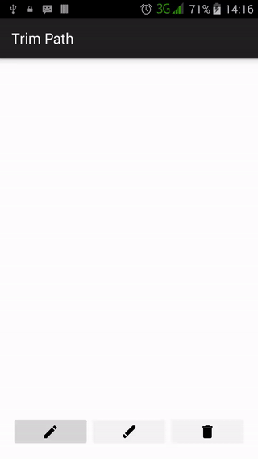

# trim-path

The handwriting is on the Android. :wink:

## Introduction :point_up:

Inside this repository is code for a sample Android app that shows how [vector images](https://en.wikipedia.org/wiki/Vector_graphics) can be used to illustrate handwriting. The app writes and unwrites (unwriting is the opposite of writing maybe?) The basis for this app was a similar one made for the [Material Design for Android Developers](https://www.udacity.com/course/material-design-for-android-developers--ud862) online [Udacity](https://www.udacity.com/) class. That app can be found in [this](https://github.com/udacity/ud862-samples) repo within a folder called [AndroidDesignTrimPath](https://github.com/udacity/ud862-samples/tree/master/AndroidDesignTrimPath).

## Version History :package:

**latest** 	[Trim Path v1.0.0](https://github.com/joshua-kairu/trim-path/releases/download/v1.0.0/Trim-Path-v1.0.0.apk) 	Monday, July 11, 2016

This repo tries its best to follow the [Semantic Versioning](http://semver.org/) guidelines.

## How To Use :wrench:

:zero: Install and run the app.

:one: You will see an empty screen with three buttons at the bottom. Only one of those is enabled - the write button.

:two: Tapping on the write button writes `Android Design` in fancy handwriting and activates the unwrite and clear buttons.

:three: Tapping on the unwrite button reverses the write - or, unwrites. You can rewrite by tapping on the write button again.

:four: Whenever the clear button is enabled, tapping it clears what is currently written.

A video of this is here:point down:

 

## How It Works

The handwriting is simply a group of vector images. We animate the individual vectors' [clip path](https://developer.android.com/reference/android/graphics/drawable/VectorDrawable.html) to make it appear that we are writing and unwriting on the screen. This animation is done by manipulating the `xml android:trimPathEnd` property of the vectors. For writing, we animate this property from zero to one and for unwriting we animate it from one to zero.  

Clearing is simply nullifying the image inside the [ImageView](https://developer.android.com/reference/android/widget/ImageView.html) that hosts the handrwriting.

The ordering of the clip path animation is crucial to the believability of the app. I tried to simply change the animation from zero to one to one to zero but since the order was still the writing order, it did not work. I needed to rearrange the order so that the unwriting animation could look as real as possible. These changes are seen in the [write_android_design.xml](app/src/main/res/drawable/write_android_design.xml) and [unwrite_android_design.xml](app/src/main/res/drawable/unwrite_android_design.xml) files.

## Abilities :muscle:

This app can:
* Write `Android Design` in an almost believable handwriting.
* Unwrite `Android Design` in an almost believable handwriting.
* Clear any written things.

## Limitations :worried:

This app is a tutorial one. There are a couple things it cannot do:
* It does not respond sweetly :candy: to orientation changes.
* It does not let you choose what to write. He he.

## Possible Future Work :fast_forward:

As of Saturday, July 2, 2016, some future work that can be done in the future could be: 
- [ ] Allow users to decide what to write.
- [ ] Create a complete vector-based alphabet.
- [ ] Respond to orientation change.

## Other things :books:

Thumbs up :+1: to:
* Udacity for the online class. Good stuff so far.
* Jake Wharton for [Butter Knife](http://jakewharton.github.io/butterknife/), a library for binding fields to views in Android. This was used to bind the click listeners for each of the buttons.
* You for reading up to here. :smile:

## License :lock_with_ink_pen:

This repository is licensed under the [GNU General Public License Version 3](http://www.gnu.org/licenses/gpl-3.0.en.html).
